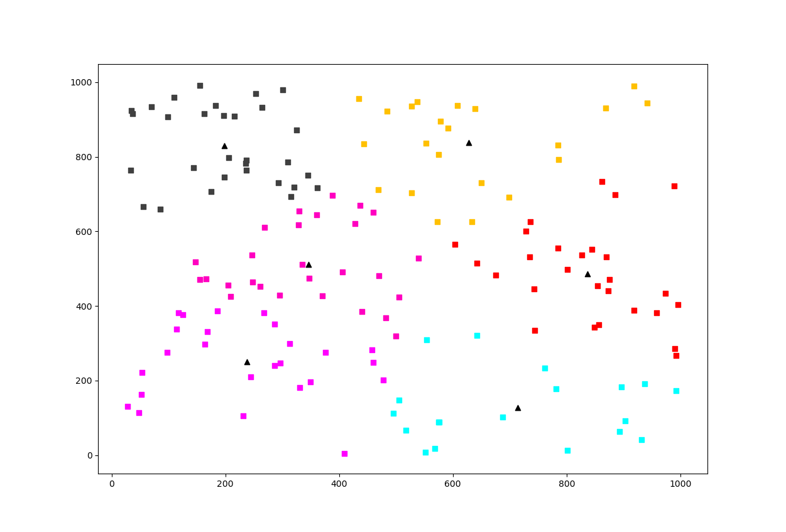
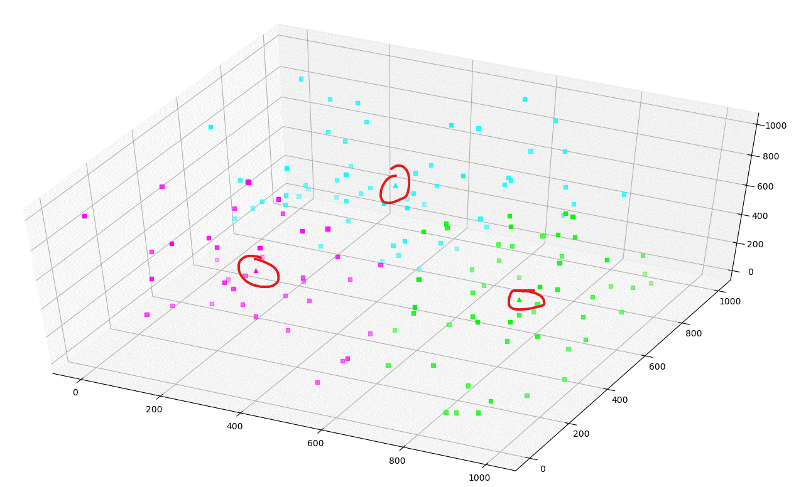

# 使用C++实现kmeans并使用Python可视化聚簇结果

## C++实现过程

### 算法流程
```
kmeans - 点作为数据，cluster是点的聚簇
BEGIN
     选出来 k 个点作为中心点生成聚簇
     循环
          计算点与聚簇的距离
          每个点加入到距离最近的聚簇中
          更新聚簇中心点
          聚簇中心点未变 或 循环次数足够？退出
     输出聚簇
END
```
### 数据结构设计

为了设计出更为通用的结构，选择采用OOP面向对象设计，结构比较复杂，尤其是**距离计算**，**求中心**这两个函数。想要通用，那么就不能限定距离的计算方法，同理，求中心点的方法也可能是任意的，因此需要作为参数传递给算法。

结构概要
```
VirtualPoint - 虚拟点类(抽象类)，无数据成员，定义了 == != 两个纯虚函数
Cluster - 聚簇类，数据成员: VirtualPoint的集合 和 中心点(VirtualPoint类型)  
          函数成员: 设置中心 更新中心 清空点...
KmeansAlg - 算法框架，run方法实现了聚类算法，提供必要参数(点之间距离计算，求平均点方法)，无需重写算法即可运行

------------------

NDimenPoint - 多维点类，继承VirtualPoint，用来处理多维数据
```

首先是两个通用类 - **虚拟点与聚簇**，实际使用的时候，继承`VirtualPoint`类，实现两个运算符之后即可(当然由于`avgPoints`和`calcDis`两个函数，可能需要添加其它方法，不过这是另一回事儿了)。
```cpp
class VirtualPoint {
private:
public:
    VirtualPoint() {}
    virtual ~VirtualPoint() {}
    // 如下的 相等 判断主要在判断中心是否更改时用到
    virtual bool operator==(const VirtualPoint &p) = 0;
    virtual bool operator!=(const VirtualPoint &p) = 0;
    virtual string toString() = 0;
};

typedef shared_ptr<VirtualPoint> sharedVPoint;
typedef sharedVPoint avgPointFunc(const vector<sharedVPoint> &); 
// 聚簇类
class Cluster {
private:
    vector<sharedVPoint> points; // 所有的点
    sharedVPoint centroid; // 中心
    avgPointFunc *avgPoints; // 计算所有点的中心的方法
public:
    Cluster(avgPointFunc avg);
    ~Cluster() {}
    Cluster &setCentroid(sharedVPoint p); // 设置中心
    bool updateCentroid(); // 更新中心，使用 avgPoints 函数更新得到新的中心，并且返回新中心是否与旧中心不同
    void clear(); // 清空点
    void addPoint(sharedVPoint p); // 添加点
    string toString(); 
    // 获取中心与所有的点，输出时用
    sharedVPoint getCentroid(); 
    const vector<sharedVPoint> &getPoints(); 
};
```

然后是kmeans主要过程类，注意下面的`run`方法为算法框架，已经实现，因此如果要针对其他数据类型实现kmeans，无需修改该类，而是继承`VirtualPoint`然后调用该类即可。
```cpp
// 计算 VirtualPoint 与 Cluster的质心 之间的距离
typedef double calcFunc(const VirtualPoint &, const Cluster &);

class KmeansAlg {
public:
    KmeansAlg() {}
    ~KmeansAlg() {}
    // 生成 k 个 位于 [0, n) 中的随机数, n < 100000000
    static vector<int> randDiffNumbers(int n, int k);
    static vector<Cluster> run(vector<sharedVPoint> data, int k, calcFunc calcDis, avgPointFunc avgPoints, const int maxRuond = 2000);
};
```

然后是一个继承`VirtualPoint`的**多维点类**，能够处理任意维度的点
```cpp
class NDimenPoint : public VirtualPoint {
private:
    int dimension; // 维度
    vector<double> xs; // x1 x2 x3 ...

public:
    NDimenPoint(const int d);
    NDimenPoint(const int d, vector<double> l);
    NDimenPoint(const NDimenPoint &p); 
    ~NDimenPoint();
    bool operator==(const VirtualPoint &p) override; // 重载，需要 static_cast
    bool operator!=(const VirtualPoint &p) override; // 重载，需要 static_cast
    NDimenPoint operator+(const NDimenPoint &p); // + / 主要用来计算点的平均值
    NDimenPoint operator/(const int n);
    double disTo(const NDimenPoint &p); // 计算到某个点的距离
    string toString() override;
    // 两个静态函数，计算点到聚簇距离 以及 计算点的中心值
    static double calcDisToCluster(const VirtualPoint &p, const Cluster &c);
    static sharedVPoint avgPoints(const vector<sharedVPoint> &points);
};
```
和多维点类一样，对于其他非点类型的数据，通过继承`VirtualPoint`，实现必要的函数之后即可调用前述`KmeansAlg`的`run`方法从而实现kmeans聚类。

## Python可视化过程

原本打算使用opengl可视化，但是绘制一个三角形就需要一二百行代码实在难以接受且低效，则选择使用`matplotlib`实现，支持二维和三维

实现过程的tips:

1. matplotlib 绘制三维图 - `plt.figure().add_subplot(111, projection='3d')`
   1. 二维参数 - `ax.scatter(xs=xs, ys=ys, zs=zs, zdir='z', c=color, marker=marker)`
   2. 三维参数 - `ax.scatter(x=xs, y=ys, c=color, marker=marker)`
2. 散点图scatter
   1. 可以在一个ax(fig.add_subplot返回值)上多次scatter
   2. 每次scatter的时候可以指定一个颜色'#000000'
   3. marker - ".": 点, ",":像素 , "o": 圈, "^": 倒三角, "+": 加, 参考[官方文档](https://matplotlib.org/api/markers_api.html#matplotlib.markers.MarkerStyle)

具体实现过程如下，代码: `build/draw.py`
```
运行kmeans算法
将结果(JSON化)输出到文件中
使用Python读取文件内容
使用pyplot可视化
```

## 部分截图

目前算法效果欠佳，如下效果图仅供参考，后续考虑使用更优化的算法。




## 关于文件
起初尝试学习使用OpenGL可视化，但过于复杂，因此改为pyplot。`include`与`lib`中的部分文件为配置OpenGL时所需，使用的`glad`+`glfw`，`include/gl.h`仍然保存了部分代码，但已不再需要。


## 已知问题

1. 聚簇后的中心点总是很奇怪（很小
   > 经过排查后发现了几点问题，一个是函数指针定义的有问题，应当是`typedef double (*name)(int para);`这种形式  
   > 另一个是重载加号运算符的问题，在`for (auto&& c: cs) a = a + c` 这样的调用中似乎a不会按照预期的不断增加，需要继续研究。
2. 重载加号运算符，然后循环调用 `a = a + b[i]`，结果不按预期
